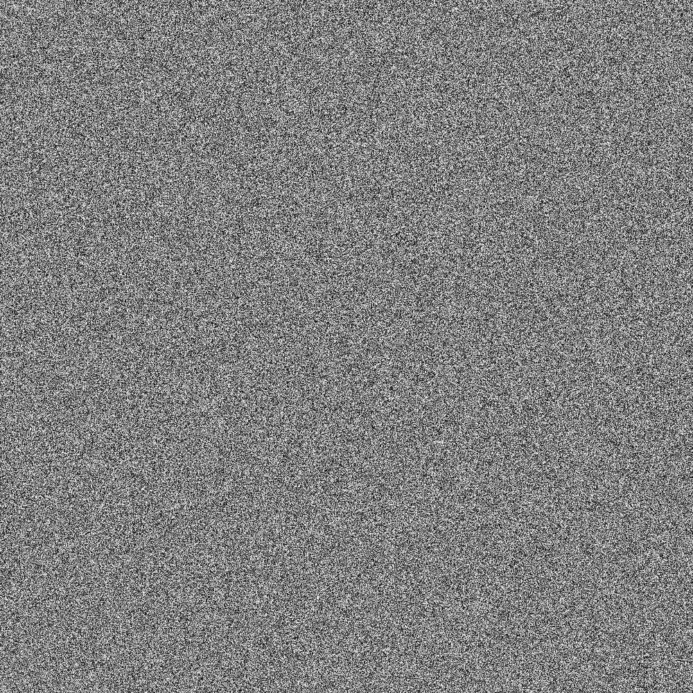
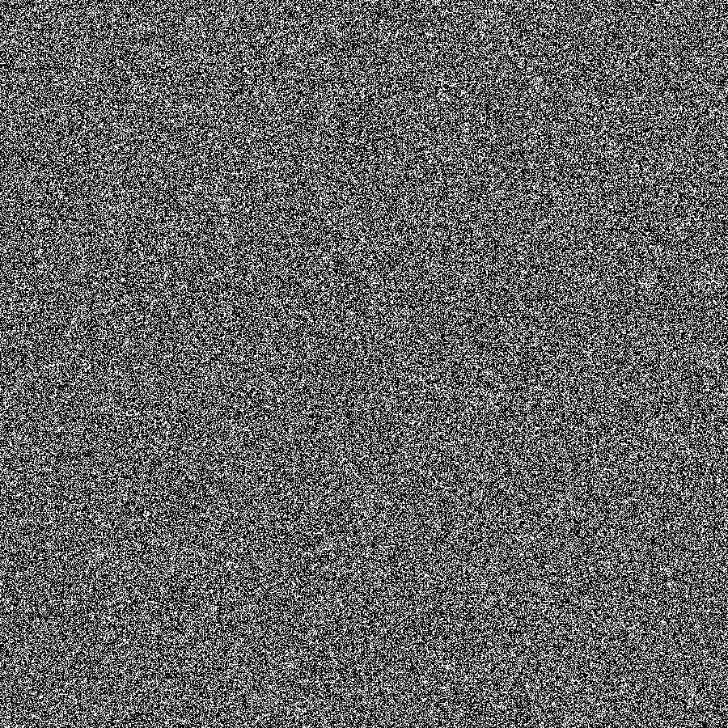

# Random-noise-texture-generator

This python script generates random noise texture.

Requiriments: numpy, pillow

<b>simple_noise.py</b> generates noise texture by assigning every element of a 2D array with random integer in range of 0..255
 
 

<b>RNTG.py</b> generates noise texture based on following algorythm:
 
 
<ol>
 <li>creates an array of 0s</li>
 <li>for a given ammount of times which is an input of (0..80000) adds 1 to a random element in the array</li>
 <li>converts this array in a way that its maximum is set to 255 and minimum is set to 0</li>
 <li>repeats this process for every tile and combines tiles in one picture</li>
 </ol>
 
 
 
  Why? Because in future im planning on develop this method and create new algorythms of generating noise on top of it.
 
 Issue: because <i>max-min</i> value is different for every tile they appear non consistent in the final result. Temporary solution is taking <i>max-min</i> of first tile and using it for the whole list of tiles.
 

